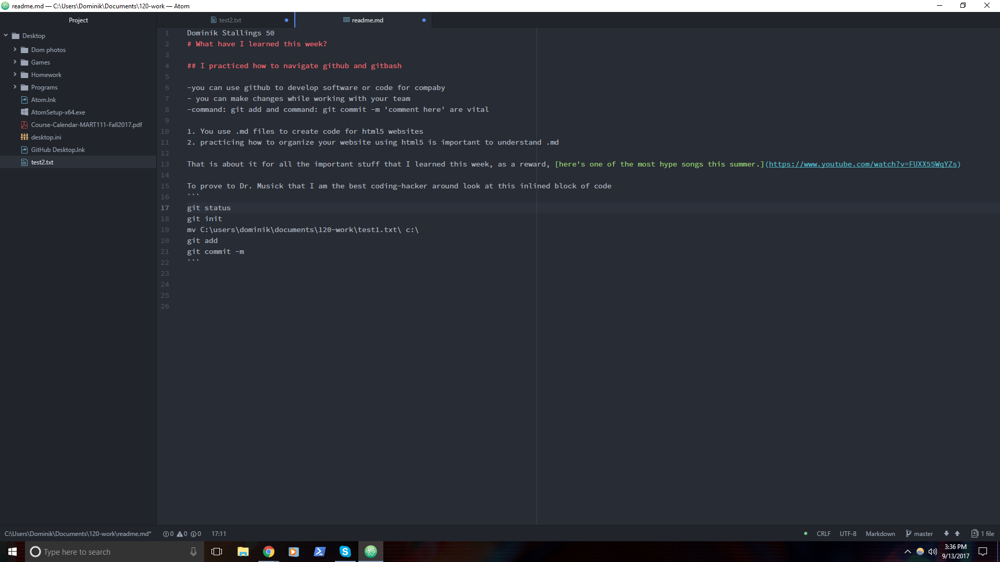

Dominik Stallings 50

# What have I learned this week?

## I practiced how to navigate github and gitbash!

- You can use github to develop software or code for company.
- You can make changes while working with your team.
- Command: git add and command: git commit -m 'comment here' are vital to development.

## What are .md files?

1. You use .md files to create code for HTML websites.
2. Practice markdown language to start understanding what HTML is and how it behaves.

## What's next? Music? Magic? Visual representation of this file?

You heard me right, you can do all that right here in this markdown file. [Here's one of the most hype songs this summer.](https://www.youtube.com/watch?v=FUXX55WqYZs) Enjoy responsibly.

To prove to Dr. Musick that I am the best coding-hacker guy around look at this inlined block of code

```
git status
git init
mv C:\users\dominik\documents\120-work\test1.txt\ c:\
git add
git commit -m
```


